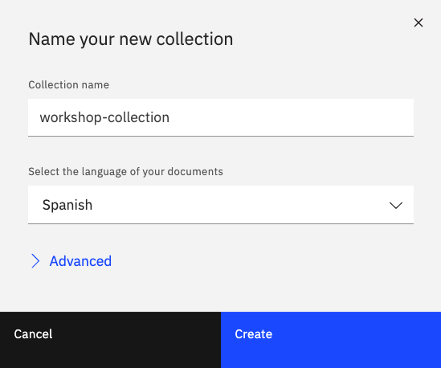
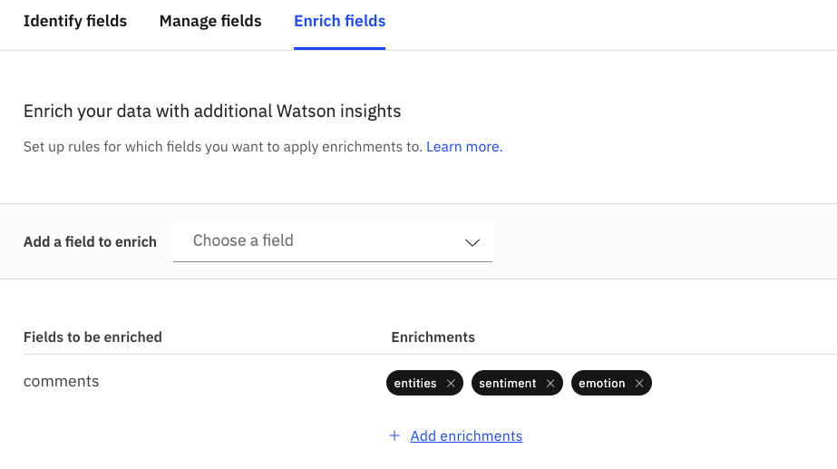
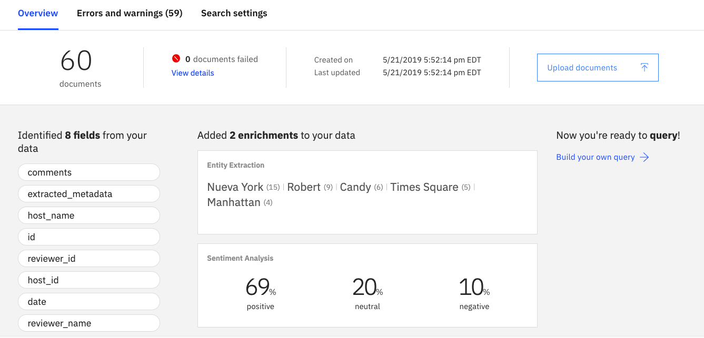
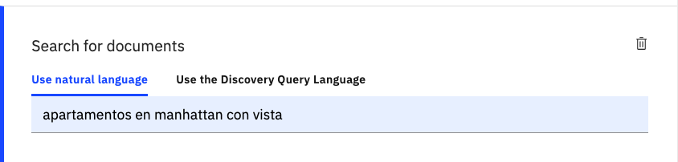
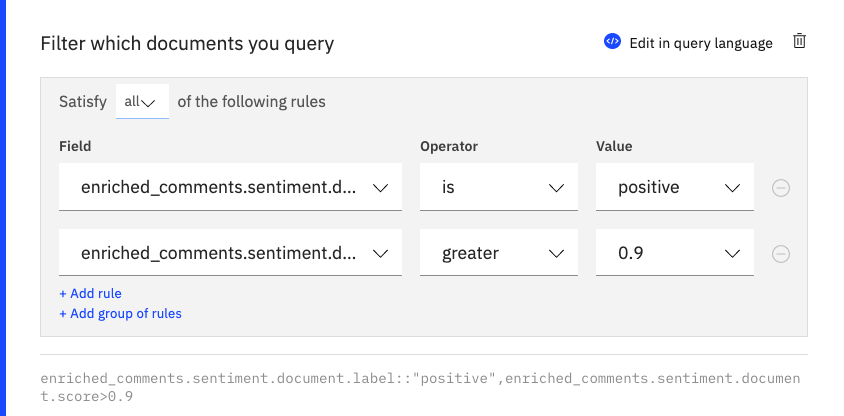
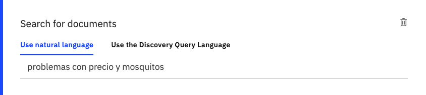
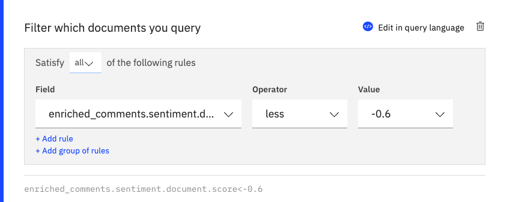
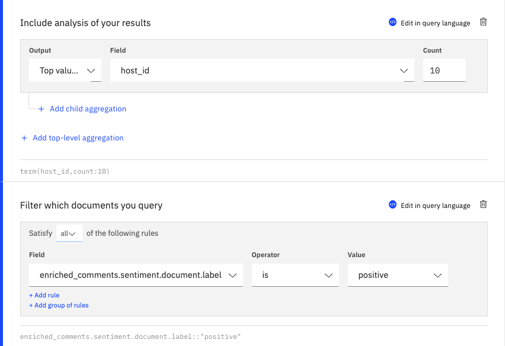
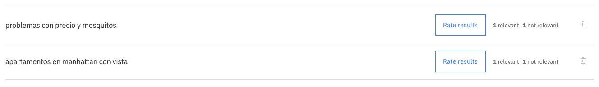
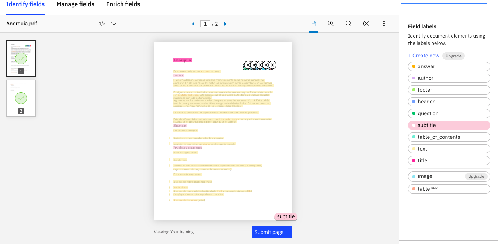

# Comenzando a usar Watson Discovery

El Servicio Watson Discovery permite extraer valor de tu información, al convertir, normalizar y enriquecerla. Utiliza una consulta simple para explorar tus datos y obtener insights ocultos en tu información no estructurada, así como embeber estas capacidades directo en tus aplicaciones.

## Componentes Incluidos
* [Watson Discovery](https://www.ibm.com/watson/services/discovery/): Watson Discovery desbloquea el valor oculto de los datos para encontrar respuestas, monitorear tendencias y patrones de superficiales con el motor de información en la nube más avanzado del mundo.

# Prerequisitos
* Cuenta activa de [IBM Cloud](https://cloud.ibm.com)

# Paso a Paso

## 1. Clonar el repo

Descarga o clona el repositorio `w-discovery` localmente. 
En una terminal, puedes ejecutar:

```
$ git clone https://github.com/libardolara/w-discovery
```

## 2. Crear los servicios en IBM Cloud
* Crea el servicio [Watson Discovery](https://cloud.ibm.com/catalog/services/discovery)

## 3. Cargar la información
* Haz click e el boton _Launch Tool_ o _Lanzar Herramienta_
* Haz click en el boton **Upload your own Data** para crear una nueva colección. 
* Llama a la colección `workshop-collection`y escoge el idioma **Spanish**



* Abre la carpeta `/reviews` del repositorio que descargaste en tu computador.
* Carga un documento de ejemplo, utilice el archivo **airbnb2.json**. Para esto es suficiente con arrastrarlo hacia la herramienta web del Watson Discovery.
* Haz click en el boton **Configure Data** para modificar la configuración con que el Watson Discovery lee, almacena y enriquece los documentos. Para mayor información revisa la documentación de [Smart Document Understanding](https://cloud.ibm.com/docs/services/discovery?topic=discovery-sdu)
* Nota que la pestaña **Identify Fields** es usada para convertir y normalizar los documentos de tal forma que se puedan identificar los campos que puedan venir en la data no estructurada. Para nuestro caso los documentos son `JSON`y son considerados data estructurada por lo cual no trabajaremos con esta pestaña.
* En la pestaña **Manage Fields** seleccionamos los campos que queremos que sean indexados en el Watson Discovery. Campos que no tengan información util los puedes de-seleccionar. Para nuestro ejercisio vamos a dejar todos los campos.
* En la pestaña **Enrich Fields** vamos a seleccionar que campos y que enriquiecimientos utilizar. Para mayor información revisa la documentación de como [Agregar Enriquecimientos](https://cloud.ibm.com/docs/services/discovery?topic=discovery-configservice#adding-enrichments)
* Borra el campo _Text_, como campo ha ser enriquecido.
* Selecciona el campo `comments`en la lista **Add a Field to Enrich**
* Haz click en el link _+ Add Enrichment_
* Selecciona los enriquecimientos **Entity Extraction** y **Sentiment Analysis**



* Finalmente haz click en el boton **Apply changes to collection** para que los cambios se apliquen sobre los documentos ya cargados y los que vamos a cargar.
* Arrastra los demas documentos ha la ventana emergente que te permite agregar nuevos documentos a la colección.
* Espera a que los 60 documentes sean agregados y procesando.



## 4. Realizar Consultas
* Haz click en el link _Build your own query_
* Haz click en la sección **Search for Documents**
* En la pestaña _Use natural language_ has una consulta como `apartamentos en manhattan con vista` y haz click en el boton **Run query**



* Observa los resultados en la pestaña **Summary** y en la pestaña **JSON**
* Haz click en la sección **Filter which documents you query**
* Selecciona _enriched_comments.sentiment.document.label_ como campo, _is_ como operador y _Positive_ como valor.
* Agrega una regla en la sección **Filter which documents you query**
* Selecciona _enriched_comments.sentiment.document.score_ como campo, _greater_ como operador y escribe _0.9_ como valor. Haz click en el boton **Run query**



* Observa los resultados en la pestaña **Summary** y en la pestaña **JSON**. Nota las diferencias con los resultados anteriores.
* Haz click en el icono de borrar para las secciones **Filter which documents you query** y **Search for Documents**
* Realiza una consulta para buscar `problemas con precio y mosquitos`con un filtro sobre el sentimiento que sea menor a `-0.6`





Para mayor información revisa la documentación sobre los [Conceptos de Consultas](https://cloud.ibm.com/docs/services/discovery?topic=discovery-query-concepts)

## 5. Realizar una consulta con Agregación
Ahora vamos a crear una consulta en la cual se agreguen los arrendatarios con mayor cantidad de opiniones positivas

* Borra todas las consultas que tengas en la herramienta.
* Agrega un filtro sobre el sentimiento para que sea `positive`.
* Haz click en la sección **Include analysis of your results**
* Selecciona _Top Value_ como resultado, _host_id_ como campo y `10` como cantidad.
* Observa los resultados en la pestaña de la agregación.



Para mayor información revisa la documentación de las [Operaciones de Agregación](https://cloud.ibm.com/docs/services/discovery?topic=discovery-query-aggregations)

## 6. Entrenamiento de Relevancia
En esta sección vamos a realizar el entrenamiento del entendimiento que tiene Watson Discovery sobre los documentos que conforman un corpus de conocimiento. Para mayor información revisa la documentacion del [Entrenamiento de Relevancia](https://cloud.ibm.com/docs/services/discovery?topic=discovery-improving-result-relevance-with-the-tooling)

* En la sección de construir consultas, haz click en el link **Train Watson to improve results**
* Haz click en el enlace **+ Add recent queries from Watson Discovery to **
* Selecciona las consultas de lenguaje natural que hemos usado `apartamentos en manhattan con vista` y `problemas con precio y mosquitos`. Haz click en el boton **Add to training list** y cierra la ventana emergente.
* Observa que las consultas hacen parte ahora de una lista de entrenamiento, en este punto podemos agregar mas consultas para entrenar o calificar los resultados de las consultas en la lista.
* Haz click en el boton **Rate results** para la consulta `apartamentos en manhattan con vista`
* Califica las respuestas con **Relevant** o **Not Relevant**. Minimo uno de cada una.
* Cuando termines con esta consulta, haz click en **Back to queries**
* Haz click en el boton **Rate results** para la consulta `problemas con precio y mosquitos`
* Califica las respuestas con **Relevant** o **Not Relevant**. Minimo uno de cada una.
* Cuando termines con esta consulta, haz click en **Back to queries**



# Paso a Paso - Trabajando con PDFs

## 1. Cargar la información

* En la pestaña de colecciones crea una nueva colección en español, llamado `PDF Medicos`
* Abre la carpeta `/enfermedades` del repositorio que descargaste en tu computador.
* Carga **5** documentos de ejemplo. Para esto es suficiente con arrastrarlo hacia la herramienta web del Watson Discovery.
* Haz click en el boton **Configure Data** para modificar la configuración con que el Watson Discovery lee, almacena y enriquece los documentos.
* En la pestaña **Identify Fields** puedes anotar los 5 documentos de ejemplo para entrenar un modelo de Machine Learning capaz de ordenar la data no estructurada de los PDFs
* Haz click en el icono de `Single page view` para acceder a la vista de pagina individual.
* En la columna de la derecha haz click sobre el campo `title` y selecciona en el documento el titulo. Nota como tu selección cambia de color.
* En la columna de la derecha haz click sobre el campo `subtitle` y selecciona en el documento los subtitulo. Nota como tu selección cambia de color.
* Cuando estes listo haz click en el boton **Submit Page**



* Repite el proceso para las paginas siguientes del mismo documento.
* En la pestaña **Enrich Fields** elimina el enriquecimiento de `sentiment` sobre el campo **text**
* Finalmente haz click en el boton **Apply changes to collection**
* Arrastra los siguientes **15** documentos para ser cargados a la colección
* Espera a que todos los documentes sean agregados y procesando.
